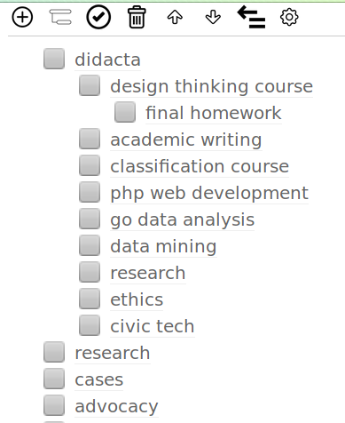

# Ultra simple personal task manager

Just view the HTML in a moder web browser. Data is saved in your local machine.

A demo is running in:

<http://falible.com/static/todo.html>

Keyboard shortcuts:

- Ctrl + Enter: New task
- Ctrl + Insert : New subtask
- Ctrl + Delete : Delete task
- Ctrl + Up : Move task up
- Ctrl + Down : Move task down
- Ctrl + Space: Collapse / Uncollapse
